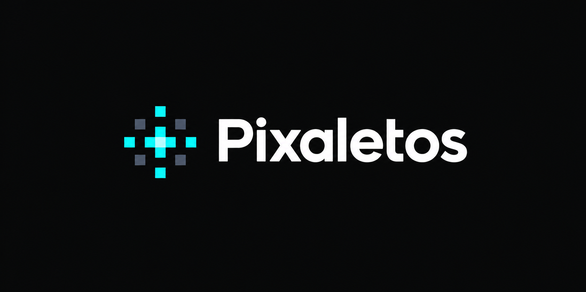

# Pixalitos

**Pronounced:** _piksa-lee-tos_

Pixalitos is an AI-powered Pixel Art Editor built with React, TypeScript, Vite, Tailwind CSS, PixiJS, and Zustand.

The project features a full command-based undo/redo system and an AI layer acting as a first-class orchestration component to understand and modify the editor state.

## Getting Started Locally

This project uses `pnpm` for package management.

### Prerequisites

- Node.js (v24 or later recommended)
- `pnpm` installed

### Installation and Running

1. Install dependencies:

   ```bash
   pnpm install
   ```

2. Start the local development server:

   ```bash
   pnpm run dev
   ```

3. Build the project:

   ```bash
   pnpm run build
   ```

4. Run linting and formatting:
   ```bash
   pnpm run lint
   pnpm run format
   ```
